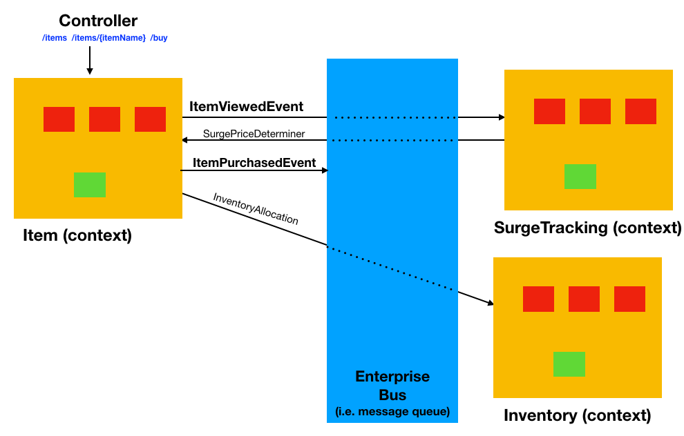
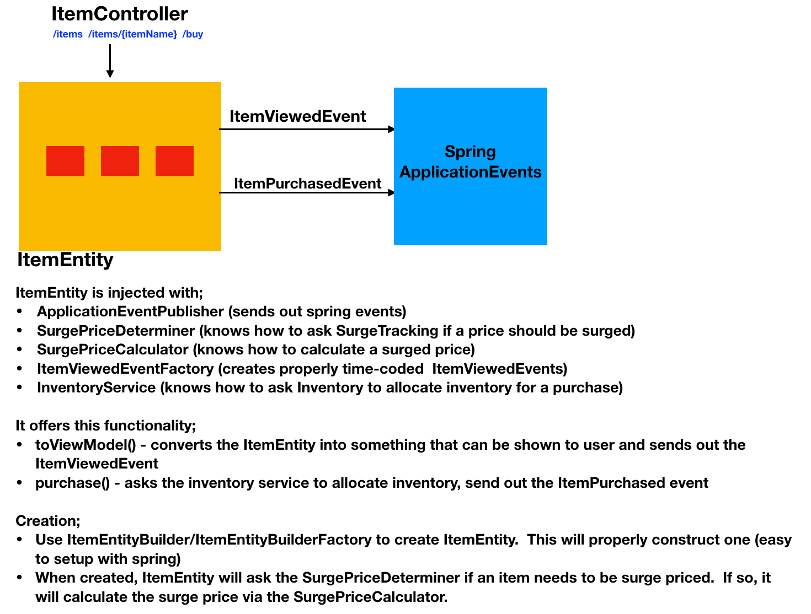
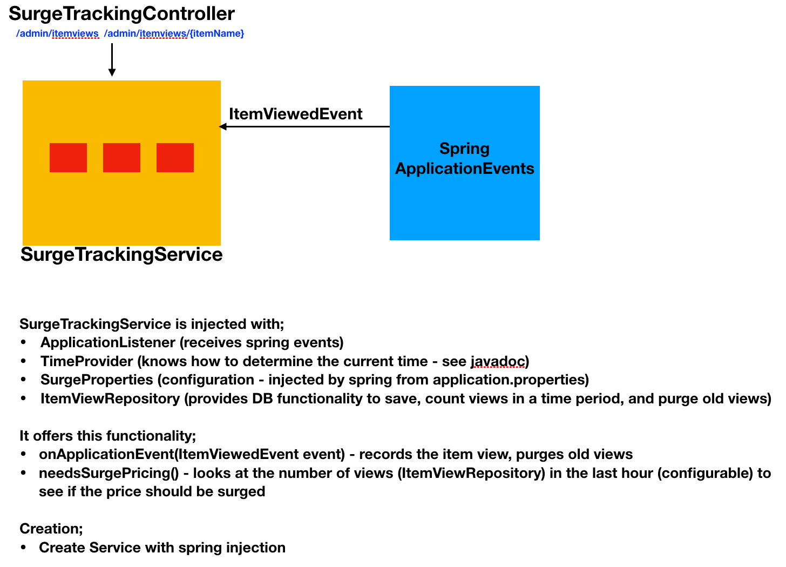
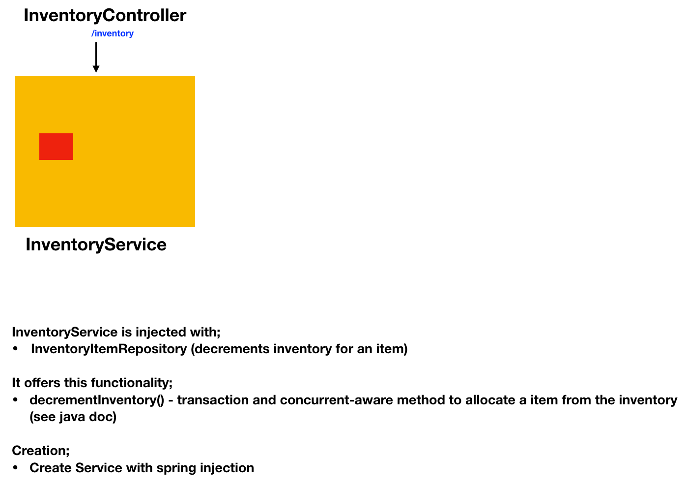

# Architecture

## Overview

I originally implemented this with a series of Services that composed (wrapped/chained) other Services that added a tiny bit of functionality.  This worked really well, and was a decent design with very clear single-purpose classes.

For example, the services to get an item were chained like this (all implementing a `ItemService` interface);

* SurgePricingItemServiceImpl - knew how to ask if an item needed to be surge priced (another service chain) and knew how to ask another service to re-price a surged item.
* ViewRecordingItemServiceImpl - knew how to call the view recording service (another chain) to record views
* BasicItemServiceImpl - knew how to get items from DB

However, I didn't quite like this architecture and decided to follow a more DDD (Domain Driven Design) approach.  Since this is such a small application (with little functionality), DDD isn't really appropriate.  However, its very good a separating concerns, using domain events, and quite popular for doing microservices.  

## Conceptual Architecture

This diagram shows the *idea* of the architecture (the next section will show the *actual* implementation).  If this were a real system, it would be a lot more complex.  For example, buying an item is actually a very detailed process - involving communicating with the purchaser, billing, shipping, package tracking, issues, order cancelling, supply chain management, etc...  

This architecture allows for keeping concerns separated, loose coupling, and ease of expanding functionality.

We've put most of the user business logic in Item context (viewing and buying).  We've put the surge tracking (determining if a price should be surged) in another context.  Finally, we've put the inventory tracking in a thirds context.  These context's are separated via an enterprise bus.  In general, these would become microservices.

* Item - handles the main user functionality.  
  * When a user views an item, it generates an ItemViewed Domain Event (which will be handled by the SurgeTracking context).  It doesn't know how to determine if an item needs to be surge priced (it goes through the bus to ask the SurgeTracking service).  Inside the Item context are other services that do things like calculate the surged price.
  * When a user buys an item, it generates an ItemPurchased Domain Event.  In this system, it isn't absorbed by anyone, but this would drive the complex "buy-an-item" workflow. The Item context does communicate with inventory to do a quick check that the user can order an item. This is similar to buying from an online store, where you place an order and you immediately get a confirmation email a little while later, and then it goes through the packing and shipping workflow.  There's lots of checks that could be done in the initial ordering part - this one just checks with the inventory system to make sure there is *likely* product available.

* SurgeTracking - this absorbs the ItemViewed Domain Event and knows how to determine if an item should be surge priced. 

* Inventory - This is a very simple check to see if a user would be able to buy something.  It just allocates inventory.

## Actual Architecture

The actual architecture is a bit different - mostly because this is a small non-production system.

* There isn't an enterprise bus:
   * The message queue is replaced with spring application events
   * We separate contexts via interfaces and spring injection
* We still use ItemViewed and ItemPurchased events, this gives loose coupling and allows for the SurgeTrackingService independently make its own decisions (i.e. should it absorb ItemPurchased events and surge based on those?)
* The actual workflow associated with purchasing would attach to the ItemPurchased event (ie. email the user, inform shipping, etc...)
* Since "buy" doesn't actually do anything, I make a simple Inventory service that pre-allocates products.
* I've added a few extra controllers so that the system admin can look at the system
* I use Spring JPA to save objects to an in-memory H2 database
* Although ItemEntity is mostly based on a simplified DDD, the inventory and SurgeTracking aren't really DDD - just ordinary spring boot services.
* ItemEntity is injected with its required services (i.e. SurgePriceCalculator, SurgePriceDeterminer, InventoryService, the spring application events service, and some factories).  This keeps the ItemEntity simple and easy to replace services with other implementations (ie. strategy objects).  For example, if you wanted to change how surge prices are calculated, just inject a different SurgePriceCalculator.

## Overview of Functionality

Lets look at what happens when you the two main APIs are called.

### Get Item

* ItemController#getItem(itemName) - called by spring boot
* ItemDB is loaded from DB (via itemDBRepository)
* We use ItemEntityBuilderFactory to create an ItemEntityBuilder.  This is setup with all the ItemEntity dependencies via spring
* We use the ItemEntityBuilder to create an ItemEntity from the DB object
     * call SurgePriceDeterminer to see if surge pricing is needed
         * it will look at the number of views in the last time frame (ie. hour) to see if there are enough (ie. >10).  See java doc
     * if needed, call SurgePriceCalculator to calculate its value
* We call ItemEntity#toViewModel() to get an ViewModel to return to the user
     * this will emit a ItemViewedEvent
        * ItemViewedEvent will be processed by SurgeTracking Service
            * it will save the ItemViewDB item to the database
            * it will purge old views
* Spring Boot will return the ViewModel to the user as JSON

If an exception occurs, we have some spring error handlers that return "better" errors to the users (ie. 404 with some information in the body).

### Purchase Item

* ItemController#buyItem(itemName) - called by spring boot with a PurchaseRequest object POSTed from user.  UserName is extraced from Spring security.
* ItemDB is loaded from DB (via itemDBRepository)
* We use ItemEntityBuilderFactory to create an ItemEntityBuilder.  This is setup with all the ItemEntity dependencies via spring
* We use the ItemEntityBuilder to create an ItemEntity from the DB object
     * call SurgePriceDeterminer to see if surge pricing is needed
     * if needed, call SurgePriceCalculator to calculate its value
* We call ItemEntity#purchase()
     * call InventoryService#decrementInventory - to allocate inventory (exception thrown if there's a problem)
     * emit an ItemPurchased event

## Database

We use an in-memory H2 database to store our objects.

I've used flyway-core to handle database migrations.  See [db.migrations](../src/main/resources/db/migration).

I use the standard JPA entities to handle persistence, and use Repositories to handle accessing them (JPA handles most of the details). 

I've also activated the H2-console - [http://localhost:8080/h2-console](http://localhost:8080/h2-console).  Make sure you are logged on as "admin" (password "admin").  If you get security exception, open a new incognito window and re-logon. 

## Authentication

I use spring security to handle authentication.  A real system would need a lot more infrastructure (create account, reset password, etc...) - so I just pre-configure some users;

* "guest" with password "password"
* "admin" with password "admin"

I use BASIC authentication (just because its simple - would use something else in the future).  I use an InMemoryUserDetailsManager to store some pre-configured users (not secure!).

See [WebSecurityConfiguration](../src/main/java/com/miw/gildedroseexpands/WebSecurityConfiguration.java)

See [SpringMethodSecurityConfig](../src/main/java/com/miw/gildedroseexpands/SpringMethodSecurityConfig.java)