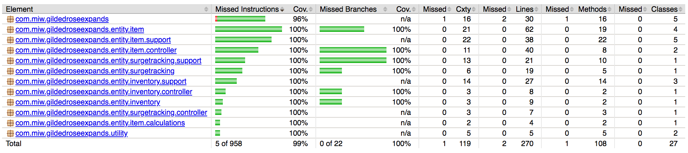

# Testing

## Running Tests

To run the tests;

`mvn test`

To generate a test coverage report;

`mvn test jacoco:report`

The generated report will be in "target/site/jacoco/index.html".

Test coverage is 100% - the only untested code is `GildedRoseExpandsApplication#main(String[] args)`, which is only one line long (and not easily unit tested).

## Integration Tests

There are several integration tests in [/src/test/java/com/miw/gildedroseexpands/integrationtests](/src/test/java/com/miw/gildedroseexpands/integrationtests).

The main test classes are;

* [IntegrationTestBase.java](/src/test/java/com/miw/gildedroseexpands/integrationtests/IntegrationTestBase.java) - this is a base class for the integration tests that setup the spring injection, test data, and TestRestTemplate.
* [InventoryIntegrationTests](/src/test/java/com/miw/gildedroseexpands/integrationtests/InventoryIntegrationTests.java) - This tests buying items and looking at the inventory (admin).
* [SimpleItemIntegrationTests](/src/test/java/com/miw/gildedroseexpands/integrationtests/SimpleItemIntegrationTests.java) - This tests looking at items (including surge pricing).
* [SecurityIntegrationTests](/src/test/java/com/miw/gildedroseexpands/integrationtests/SecurityIntegrationTests.java) - This tests that security is being restricted (i.e. need to be logged on to buy).

These all use the `TestRestTemplate` to make real request to the system.  Test data is pre-populated.

## Spring Tests (Controllers and Services)

There are several spring tests - 
  * [item](/src/test/java/com/miw/gildedroseexpands/item) - tests associated with the ItemEntity.  This includes ensuring viewing and buying sends events (see [arch](arch.md)) and the support services are working correctly.
  * [inventory](/src/test/java/com/miw/gildedroseexpands/inventory) - tests associated with Inventory (i.e. allocating inventory) 
  * [surgetracking](/src/test/java/com/miw/gildedroseexpands/surgetracking) - tests recording, purging, and counting views associated with viewing item (determines if a price should be surged).

These will test the Repository, Controller, and any Services.  They typically mock (mockito) dependencies to make sure that they are being correctly called.

## Unit Tests

There are a set of simple unit tests in [trivialobjecttests](/src/test/java/com/miw/gildedroseexpands/unit/trivialobjecttests).

These tests are for objects with little-to-no behaviour (i.e. JPA Entities, ViewModel Objects) and some very simple functionality (i.e. [TimeTests](/src/test/java/com/miw/gildedroseexpands/unit/trivialobjecttests/TimeTests.java)).

